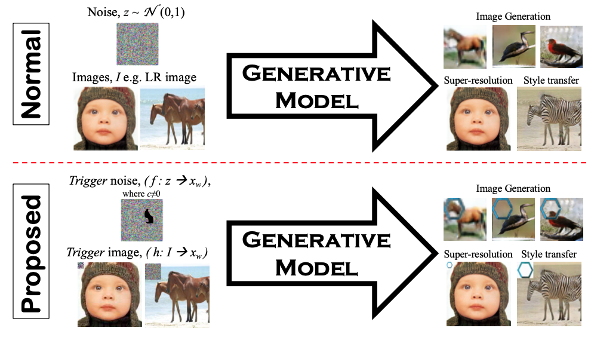

# GAN IPR Protection

[ArXiv](https://arxiv.org/abs/2102.04362)

### Official pytorch implementation of the paper: "Protecting Intellectual Property of Generative Adversarial Networks from Ambiguity Attack"

#### CVPR 2021

Released on March 22, 2021

## Description

<p align="justify"> Ever since Machine Learning as a Service (MLaaS) emerges as a viable business that utilizes deep learning models to generate lucrative revenue, Intellectual Property Right (IPR) has become a major concern because these deep learning models can easily be replicated, shared, and re-distributed by any unauthorized third parties. To the best of our knowledge, one of the prominent deep learning models - Generative Adversarial Networks (GANs) which has been widely used to create photorealistic image are totally unprotected despite the existence of pioneering IPR protection methodology for Convolutional Neural Networks (CNNs). This paper therefore presents a complete protection framework in both black-box and white-box settings to enforce IPR protection on GANs. Empirically, we show that the proposed method does not compromise the original GANs performance (i.e. image generation, image super-resolution, style transfer), and at the same time, it is able to withstand both removal and ambiguity attacks against embedded watermarks.</p>

<p align="center">     </p>
<p align="center"> Figure 1: Overview of our proposed GANs protection framework in black-box setting.k </p>

## How to run

For compability issue, please run the code using `python 3.6` and `pytorch 1.2`


## Citation
If you find this work useful for your research, please cite
```
@inproceedings{GanIPR,
  title={Protecting Intellectual Property of Generative Adversarial Networks from Ambiguity Attack},
  author={Ong, Ding Sheng and Chan, Chee Seng and Ng, Kam Woh and Fan, Lixin and Yang, Qiang},
  booktitle={Proceedings of the IEEE/CVF Conference on Computer Vision and Pattern Recognition (CVPR)},
  year={2021},
}
```

## Feedback
Suggestions and opinions on this work (both positive and negative) are greatly welcomed. Please contact the authors by sending an email to
`sheng970303 at gmail.com` or `cs.chan at um.edu.my`.

## License and Copyright
The project is open source under BSD-3 license (see the ``` LICENSE ``` file).

&#169;2021 University of Malaya and WeBank.
